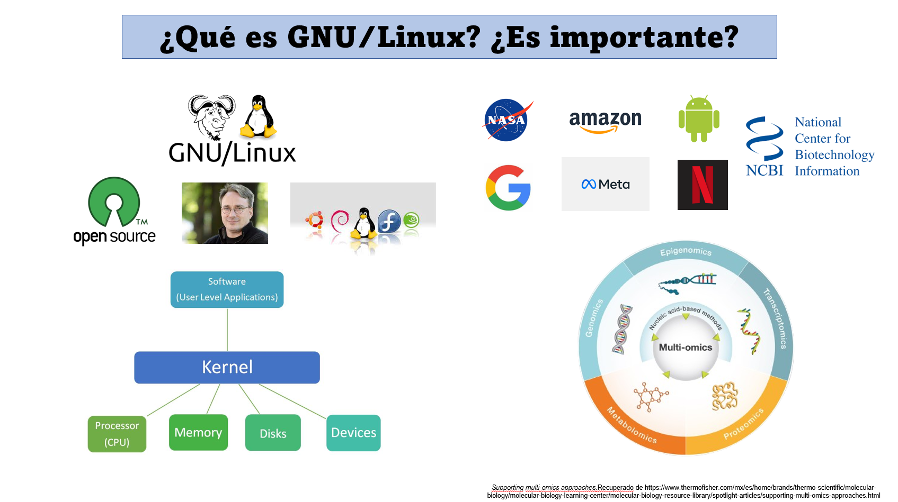

# Terminal Linux

### **Introducción**

Hola, Mundo.

Hoy hablaremos un poquito sobre **Linux**, de una forma simple pero efectiva.

Linux es un *Kernel*, es decir, es el "núcleo" de un sistema operativo (SO) y es quien regula los recursos de una computadora, la interacción software-hardaware. El kernel de Linux es de código abierto, lo que significa que su código fuente está disponible para ser modificado, mejorado y adaptado a diferentes dispositivos y necesidades.

Si bien estrictamente el verdadero sistema operativo es GNU/Linux, se entiende que **Linux** es un sistema operativo. La acotación importante deberá ser ¿de cuál distribución de Linux estamos hablando? Linux existe en distintas versiones diseñadas para fines diferentes y por ende su funcionamiento puede variar entre distribuciones pese a tener una base común. Este punto común es el sistema operativo UNIX de AT&T, el mismo de Mac OS. Por ende, mucho de lo que se hace en Linux se puede hacer con Mac, lo complejo viene cuando quremos trabajar con Windows. :( 

Si bien Windows es el SO más popular en el mundo, especialmente en equipos personales de compúto, la realidad es que nivel industria Linux tiene mayor presencia en el mercado. La mayoría de los servidores en el mundo usan Linux, como los de Google, Amazon, Facebook, NASA e incluso Netflix. 

Para nosotros resulta importante conocer y manejar aunque sea de una forma básica este sistema... si en algún momento trabajamos con datos de secuenciación masiva, simulación de sistemas complejos, modelado 3D o cualquier tarea que requeira grandes recursos computacionales nuestra computadora personal seguramente quedará corta. En este escenario necesitaremos conectarnos a un *cluster* o a una *workstation* y los más seguro es que su SO sea Linux. Además, muchas de las herramientas computacionales empleadas en las ciencias omicas están implementadas en Linux. 

Una de las características de Linux es el uso de la terminal. Aunque el SO  tiene un interfaza gráfica como cualquier otro, realmente Linux se trabaja a través de línea de comandos, en especial porque cuando nos conectamos a un servidor o computadora Linux, no tenemos acceso o no existe la interfaz gráfica. Una de las ventajas de la terminal es que consume mucho menos recursos que la interfaz gráfica, lo cual optimiza los procesos. 

----

### **Trabajando en la terminal:**

Nota: las salidas que verán son un ejemplo, corresponden a mi equipo y por ende tú tendrás una distinta en comandos que dependen del contexto de la computadora. En esta guía los camandos a ejecutar los verás en una especie de caja, podrás copiarlos y pegarlos directamente en tu computadora. Además, la salida se representa después del signo ">" a manera de ejemplo. Tú verás la salida en tu terminal. 

Lo que nos importa es que cuando se enfrenten a un sistema Linux se sientan confiados. Para ello veremos como movernos en la terminal, generar archivos, ejecutar script's y algunos otros tips que les podamos brindar. 

**Lo primero que deben saber es lo siguiente: a terminal funciona a través de comandos. La estructura básica de un comando es la siguiente:** 

    comando [opciones] [argumentos]

Cuando abrimos la terminal entramos a un directorio pero no sabemos a cuál. Entonces, para saber en que directorio nos situamos podemos ejecutar el comando *pwd* el cual **va imprimir el directorio actual de trabajo:**
    
    pwd
---
    > /home/jrmarval 

Esto también es útil para especificar rutas en nuestros comandos o script´s.

Para tener un orden en nuestra computadora y en este curso, vamos a crear una carpeta para almacenar todos los archivos que vayamos generando. Para hacer esto usaremos el comando *mkdir*:

    mkdir curso_bioinfo

Cuando corran este comando no verán alguna salida pero el directorio ya fue generado. Si queremos ver los elementos que están en un directorio usamos el comando *ls*

    ls
---
    > [Elementos presentes en el directorio]

    ls -lh
    > total 12K
    drwxr-xr-x 9 jrmarval jrmarval 4.0K Nov  9 15:19 RNAseq_uivc

    drwxr-xr-x 4 jrmarval jrmarval 4.0K Dec  2 02:49 bioinf_inm_encb_ipn

    drwxr-xr-x 2 jrmarval jrmarval 4.0K Dec  2 02:49 curso_bioinfo_inm_encb

    -rw-r--r-- 1 jrmarval jrmarval   16 Dec  2 03:00 test.txt

Como vemos nuestro directorio **curso_bioinfo** fue creado. Ahora para movernos entre directorios usamos el comando *cd*. Veremos que el prompt muestra el nombre del directorio actual de trabajo.

    cd curso_bioinfo
---
    > [jrmarval@LAPTOP-8SI0DC1R:~/marval/curso_bioinfo$]

Si queremos regresar al directorio anterior ejecutamos:

    cd ..
---
    > [Directorio anterior de trabajo]

Si quisieramos movernos a una ruta en especial podemos indicar la ruta destino en un solo comando:

    cd /rutadestino

¿Qué pasa cuándo se ejecuta?

    cd -
---
    cd --

Ahora que estamos dentro de nuestro directorio de trabajo sería bueno crear un archivo. Para ello usaremos un editor de texto plano, algo así como un Word-Office pero versión sencilla para la terminal. Existen varias herramientas, pero nosotros usaremos *nano*. Vamos a generar dos archivos para seguir con los ejercicios.  

    nano file1.txt
---
    nano file2.txt

Lo anterior abre una ventana en la que podemos escribir todo lo que nos podamos imaginar. Para visualizarlos de una forma sencilla usamos el comando *less*.

Es importante cuidar la extensión del archivo, pues esto determina las características del mismo. Podemos tener un archivo de texto plano (txt), algún script ejecutable para Bash (.sh) o Python (.py). Muchas veces no es necesario indicar la extensión, pero hacerlo es una buena práctica para identificar el tipo de archivos con mayor facilidad, así que tratemos de hacerlo siempre. 

Una parte importante del crear algo es tener la capacidad de poderlo borrar y para ello tenemos el comando *rm*.

    rm file1.txt 

Para eliminar un directorio con los elementos que estén en el, debemos hacerlo agregando una opción al comando anterior.

    rm -r curso_bioinfo

Imagina que tienes 10 archivos, 5 con la terminación txt y otros 5 con csv. Y quieres eliminar únicamente los .txt ¿Cómo lo harías?

Tip: wildcard *

**Ojo: en la terminal no existe la "papelera" por lo que debemos ser muy cuidadosos cuando queramos borrar algo, una vez eliminado no hay vuelta atrás.** 

Otra función importante y que nos ayudará a proteger nuestra información es realizar copias de nuestros archivos. Para copiar un archivo usamos el comando *cp*:

    cp file1.txt /direcorio_destino

Pero si lo que queremos es solo cambiar la ubicación de un archivo empleamos el comando *mv*:

    mv file1.txt curso_bioinfo

Este comando también sirve para cambiar el nombre de un archivo, en este caso en lugar de indicar la ruta destino deberemos indicar el nuevo nombre del archivo:

    mv file1.txt new_file1.txt

Debemos tener cuidado de copiar o mover archivos archivos con nombres idénticos a algún otro archivo en el directorio destino, pues esto sobreescribirá la información del archivo residente y podríamos perder la información original. 

Para tener más claro la idea de sobrescribir un archivo en Linux hagamos lo siguiente. Escribe "Hola" en un archivo test.txt.

    nano test.txt

Ahora pongamos:

    echo "adios" > test.txt

¿Qué sucedió? ¿Qué hace el comando *echo*?
Ahora escribe:

    echo "Hola, de nuevo" >> test.txt

¿Ahora qué sucede?

---
#### **Script**

Como habrás notado puedes hacer tareas directamente en la terminal pero cuando tengas una tarea mayor y repetitiva frente a ti no es tan buena idea introducir el comando *n* cantidad de veces, esperando a que termine un proceso para ingresar el siguiente comando. Podemos hacer que la computadora trabaje para nosotros al unificar la secuencia de comandos y ejecutarlos al mismo tiempo. Así podríamos irnos a casa mientras la computadora trabaja.   

Automatizar un proceso es posible gracias a los **scripts**, un archivo ejecutable por un lenguaje de programación como R, Python o Bash. En el caso de Linux el empleado por el SO es Bash, si quieres saber que interprete de Shell (comandos por terminal) tiene tu equipo simplemente ejecuta:

    echo $SHELL

Para crear un script de Bash usamos el editor de textos *nano* y lo guardamos con la extensión sh.

    nano mi_primer_script.sh

Una vez dentro del editor escribimos:

    #!/bin/bash
    echo "Hola, $USER"

Para ejecutar el el script:

    ./mi_primer_script.sh

**¿Cuál es el resultado? ¿El script funcionó? ¿Tiene idea de que pasó? ¿Comó defines $USER?**

Recordemos que Linux es un sistema multiusuario, es decir, varias personas pueden estar trabajando en él al mismo tiempo por lo que la gestión de recursos y de permisos es un aspecto clave. Para resolver esto, hay todo un sistema de permisos que te permiten realizar ciertas tareas. Veamos esto de forma práctica ejecutando:

    ls -lh
---

    drwxr-xr-x  4 jrmarval jrmarval 4.0K Nov  7 21:28 evo_helena

    drwxr-xr-x  5 jrmarval jrmarval 4.0K Dec  2 03:53 marval

    -rwx------  1 jrmarval jrmarval   33 Dec  2 13:30 mi_primer_scrip.sh

    drwxr-xr-x 19 jrmarval jrmarval 4.0K Oct 23 01:59 miniconda3

    drwx------  3 jrmarval jrmarval 4.0K Oct 26 11:09 snap

    drwxr-xr-x  2 jrmarval jrmarval 4.0K Oct 23 01:58 software

    ----------  1 jrmarval jrmarval   67 Nov 15 11:32 time.sh

Este comando nos enlista los elementos del directorio actual de trabajo, pero también nos indica si se trata de un directorio o de un archivo. Además, nos indica los permisos que tiene cada uno de los elementos. Esto esta codificado en tercias que corresponden a la actividad a realizar; **x:ejecutar | r:leer | w:escribir**. Esto es aplicable para tres tipos de usarios: propietario, grupos y otros.

Para dar los permisos de ejecución a un archivo se usa un código numérico.

    Leer        | 4
    Escribir    | 2
    Ejecutar    | 1

Por ejemplo, si queremos que un script tenga todos los permisos para todos los usuarios ejecutamos:

    chmod 777 time.sh
    ls -lh

    -rwxrwxrwx  1 jrmarval jrmarval   67 Nov 15 11:32 time.sh

Ahora, modifica los permisos necesarios para que solo tú (propietario) puedas ejecutar el archivo mi_primer_script.sh y verifica que los permisos hayan cambiado. Una vez hecho esto, ejecuta el script.

    ./mi_primer_script.sh

¿Qué será $USER? Se trata de una variable de entorno GLOBAL que contiene el usuario del sistema. El punto importante aquí es que podemos declarar variables (un contenedor de información) en Linux para mejorar nuestros programas. Editando un poco nuestro script:

    #!/bin/bash
    echo "Hola, $1"

¿Cuál será la salida? Pues en efecto será un saludo con el contenido de la variable $1, la cual se define en la línea de comandos:

    ./mi_primer_script.sh tu_nombre
---
    > Hola, tu_nombre

Ahora si quieres saber cuánto tiempo tardó en ejecutarse tu script puedes correr:

    time ./mi_primer_script.sh 

Con este ejemplo no verás muchas diferencias porque el proceso es muy rápido, pero en tareas que toman mucho tiempo, saber cuánto tarda en ejecutarse un proceso es muy útil para optimizar nuestro trabajo (por ejemplo, el ensamble de secuencias de RNASeq o Genoma podría demorar mucho tiempo. Esto también depende de los recursos computacionales con los que cuentes). Veamos el siguiente script:

    #!/bin/bash 
    # Obtener la fecha actual
    DATE=$(date)
    echo "El script inicia $DATE"
    echo  Hola, $1
    sleep 10
    # Obtener la fecha nuevamente
    DATE=$(date)
    echo Oye $1, el proceso ha terminado $DATE

¿Qué hace y cómo se comporta este script?

Cuando lanzamos un proceso que toma tiempo la terminal queda "secuestrada", lo cual es un impedimento para seguir trabajando. Para ello podemos lanzar el script en segundo plano:

    nohup ./mi_primer_scrip.sh Raul &

    nohup ./mi_primer_scrip.sh Raul  > salida.txt 2> errores.txt &

¿Cuál es la diferencia entre estas dos maneras de ejecutar el scrip?

 Cada proceso genera un PID (Identificador de Procesos) y este puede ser rastreado para saber si mi proceso sigue en ejecución.
    
    ps -p <PID>
---
    ps aux | grep <PID>

Para ver todos los procesos de la computadora usamos el comando *top*.
Así como tenemos la capacidad de ejecutar procesos, también podemos deternerlos. Para ello requerimos conocer su PID y ejecutar el siguiente comando:

    kill -9 <PID>

Finalmente, veremos los *loops/ciclos/bucles* una manera de optimizar nuestros procesos, son una declaración de iteración lo cual esto es realmente útil para tareas repetitivas. 

El primero ciclo que veremos será el *for*,  este realiza una tarea para una variable en un conjunto de elementos. 

    #!/bin/bash
    for i in 1 2 3 4 5; do
    echo "Hello $i"
    done

---

    #!/bin/bash
    # Ciclo for que imprime los números del 1 al $1
    for ((i = 1; i <= $1; i++)); do
        echo "Número: $i"
    done
    echo Ciclo finalizado. 

---

    #!/bin/bash
    for i in * ; do
        echo He trabajado con el archivo = $i
    done

También existen ciclos condicionales, es decir, que se realizan solo si se cumple con una condición y en caso de no hacerlo se realiza otra tarea. Por ejemplo: 

    #!/bin/bash

    # Ejemplo para emitir un mensaje con base en una condición

    edad=$1
    if [ $edad -ge 18 ]; then
        echo "Eres mayor de edad."
    else
        echo "Eres menor de edad."
    fi

[Material sobre Operadores](https://medium.com/enredando-con-linux/linux-shell-operadores-8f385713e8ad) 

Otro tipo de ciclo importante es el *while*, el cual ejecuta una función mientras una condición sea verdadera:

    #!/bin/bash
    # Inicializar un contador
    contador=1
    # Ciclo while que cuenta hasta $1
    while [ $contador -le $1 ]; do
        echo "Contador: $contador"
        ((contador++))
    done

---

### **Ejercicio:** 

1. Crea una carpeta llamada loop_for; coloca una imagen en ella y ponle el nombre que tú quieras. Ahora deberás generar esa imagen 5 veces usando el nombre que le diste como prefijo, seguida de un número (1-5) para distinguir cada imagen. Después deberás ponerlas en un fichero llamado new_name, pero ahora las imágenes llevaran el prefijo "figura" seguido del número que le corresponde. Realiza un script para esto y entre más automatizado se encuentre muchísimo mejor. 

2. Escribe un script que realice la tarea que tú quieras pero deberás emplear un ciclo *if* y/o *while*.

**Nota:** la computadora no piensa, solo hace cosas y a veces esas cosas no son las que queremos. 

---

### **Tips:**

+ Es importante cuidar el nombre de variables, archivos y directorios. Procura que sean breves, descriptivas, que no inicien con mayúsculas ni con números. Pero sobre todo que no contengan espacios, si consideras necesario poner un espacio puedes indicarlo con un guión bajo "_".

+ Siempre realiza un respaldo de tus datos, que sea lo primero que hagas.

+ Cuida el redirigir tus salidas, podrías perder información.

+ Es muy importante conocer la computadora, saber sus características te dará una idea de lo que puedes hacer. ¿Qué información se obtiene al ejecutar?

        lscpu

+ Siempre debemos  testear nuestros scripts con datos de prueba antes de ejecutarlos con datos reales.

## **Dudas y comentarios**
**¿Linux es importante?**

